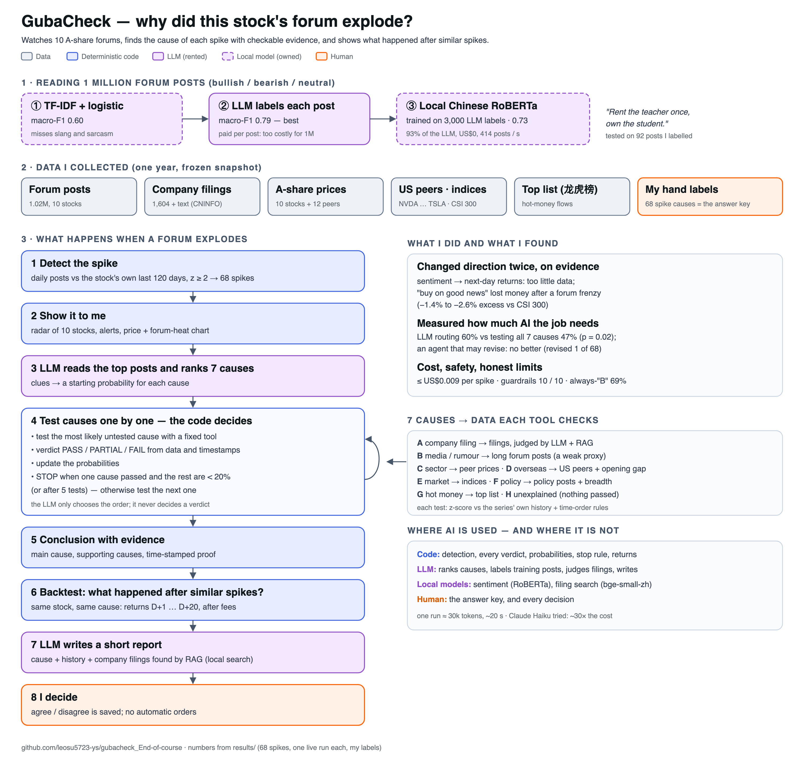

# GubaCheck

**When a stock's forum suddenly explodes, GubaCheck finds out why — and shows how spikes with that cause behaved afterwards.**



A local Chinese RoBERTa reads ~1 million Eastmoney forum titles. A z-score engine flags spikes. An attribution agent scores seven candidate causes from the posts' clues (company filing, media rumour, sector, US read-through, market, policy, money flow), tests them in order of probability with fixed, code-graded tools that respect time order, and stops when the remaining causes are unlikely. Each cause's history (D+1 … D+20 returns) is shown alongside.

| Document | What it covers |
|---|---|
| [video/AI Agent Cuts Stock Forum Spikes.mp4](video/AI%20Agent%20Cuts%20Stock%20Forum%20Spikes.mp4) | Demo video (7 min 41 s): the problem, a live investigation in the app, evaluation and limits |
| [report/REPORT_V4.md](report/REPORT_V4.md) | The project report (≈1,200 words): problem, design changes, where AI is useful, build vs buy, evaluation critique, next steps |
| [PRODUCT.md](PRODUCT.md) | Persona, input/output, architecture, own-vs-rent, metrics targeted vs reached, cost, responsible use |
| [RULES.md](RULES.md) | Every rule and threshold, registered before results, with a change log |
| [data/DATA.md](data/DATA.md) | Sources, provenance (incl. how the forum data was collected), labels, limitations |
| [evals/EVALS.md](evals/EVALS.md) | Every evaluation, how to run it, what it can and cannot tell |

## Run it (no key, no network)

Python 3.9+. These commands use the standard library only — no `pip install` needed.

```bash
python3 run_eval.py --arm=keyword          # attribution, rule-based clue scorer (scripted)
python3 run_eval.py --arm=exhaustive       # attribution, all seven tests (scripted)
python3 run_eval.py SPK-688256-20260203    # one spike, every step shown
python3 run_guardrails.py                  # 10-case guardrail checklist
python3 demo_failures.py                   # the two reproduced failures
python3 -m unittest discover tests         # unit tests
```

Front end (Chinese / English) — **Python 3.11+** (tested on 3.13; `akshare` and current Streamlit need it):

```bash
python3 -m venv .venv && source .venv/bin/activate
pip install -r requirements.txt
streamlit run app/streamlit_app.py
```

No key is needed: saved live investigations are replayed. In the app: ⚙️ API takes your own OpenRouter key (kept in the browser session only) and a model from OpenRouter's catalogue with its live price; 🔔 lists the spikes of the last 30 days (the ticker next to it cycles through them; click one to open its investigation); the data bar shows Beijing time and how fresh each loaded source is; 🔄 Update data refreshes every source incrementally (`python3 -m pipeline.refresh`; needs the raw data in `data/raw/`, which is not in the repository).

## Live runs (OpenRouter, costs cents)

```bash
export OPENROUTER_API_KEY=...  GUBACHECK_MODEL=deepseek/deepseek-v4.1-flash   # prices are read from OpenRouter; billed cost is recorded per call
GUBACHECK_BACKEND=live python3 run_eval.py --arm=agent   --workers=4
GUBACHECK_BACKEND=live python3 run_eval.py --arm=routing --workers=4
python3 -m pipeline.judge run rag           # filing judge with chunked RAG
python3 -m pipeline.model_compare          # every live model x arm: accuracy, cost, paired test vs the reference
python3 -m pipeline.model_compare SPK-300308-20260728 --models=deepseek/deepseek-v4.1-flash,anthropic/claude-haiku-4.5   # one spike, one run per model
```

## Rebuild from raw data

```bash
python3 -m pipeline.import_guba ../guba            # full-year forum dataset (see DATA.md)
python3 -m pipeline.bert_sentiment train && python3 -m pipeline.bert_sentiment predict
python3 -m collectors.market_data cninfo|prices|hot_rank ...
python3 -m collectors.announcements && python3 -m pipeline.rag build
python3 -m collectors.context_data                 # peers, US peers, indices, top list
python3 -m pipeline.anomaly                        # v4 spikes (z-scores)
python3 -m pipeline.context_snapshot && python3 -m pipeline.redteam
python3 -m pipeline.v4_scripts                     # scripted arms + evals/cases.json from hand labels
python3 -m pipeline.cause_backtest gold            # D+N by cause
python3 -m pipeline.cost_model
```

## Repository map

| Path | What it is |
|---|---|
| `core/investigation.py` | Priors, posterior (PASS ×3 / PARTIAL ×1 / FAIL ×0.2), stop rule, arms |
| `core/causes.py` | The seven fixed cause tools; verdicts computed from z-scores and timestamps |
| `core/tools.py`, `core/prompt.py` | What the model can call and what it is told |
| `core/agent.py`, `core/backends.py` | The loop (instrumented) and the scripted / live backends |
| `core/guardrails.py` | Step cap, budget, de-duplication, stop-rule refusal, hostile text, order guards, gate |
| `core/harness.py`, `run_eval.py` | Arms, grading against hand labels, reports |
| `pipeline/` | Sentiment (TF-IDF, RoBERTa), filing judge + RAG, anomaly engine, backtests, cost model, incremental refresh |
| `collectors/` | Forum, CNINFO, prices, news, context data |
| `app/streamlit_app.py` | Front end |
| `data/snapshot/` | Frozen inputs every tool reads; `data/labels/` hand and LLM labels |
| `evals/`, `results/` | Cases, scripted moves, guardrail cases; every reported number |

**Earlier designs** (buy after an official filing; forward-watch backtest) are kept in `RULES.md` and `results/backtest_*.json`. Their negative result — buying on official good news after a forum frenzy lost money on average — is what led to the attribution design.

## Acknowledgements

The agent-loop, guardrail and scripted/live backend structure is adapted from the PE6201 course starter code; the problem, tools, data, rules, evaluation sets and results are my own. An AI coding assistant was used during development; I can explain every module.
